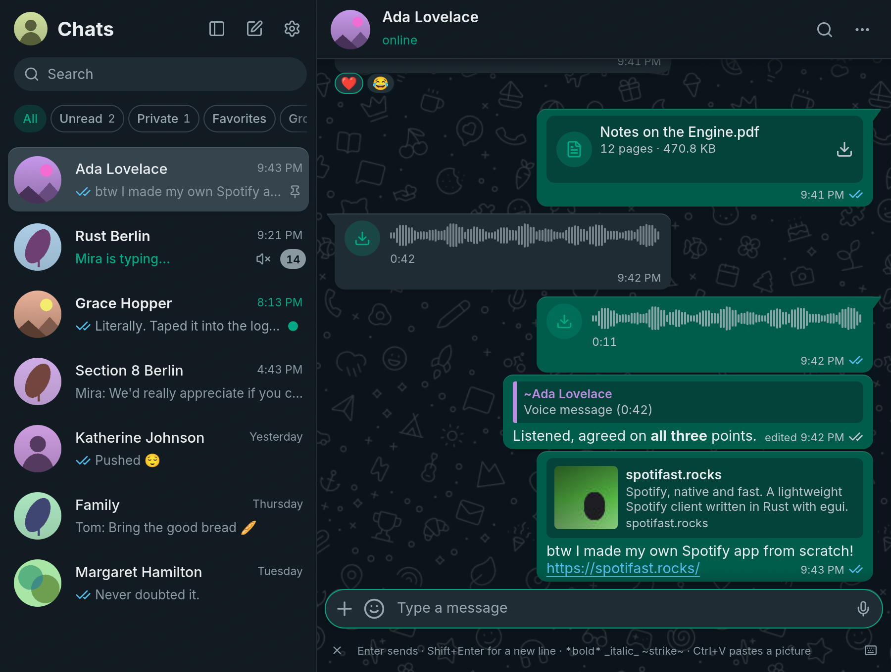
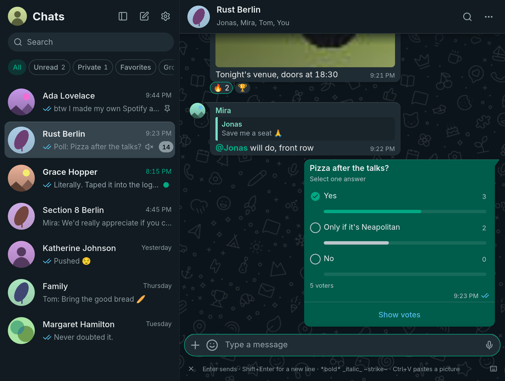
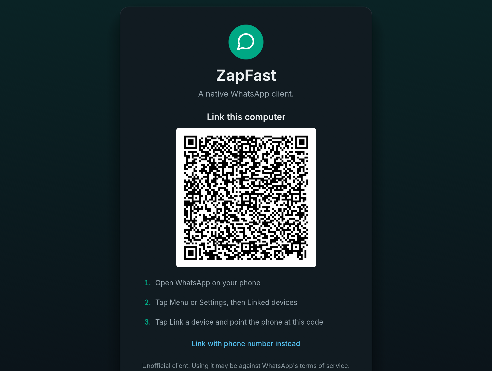

# ZapFast

**WhatsApp, native and fast.** ZapFast is a WhatsApp client written in Rust
with [egui](https://github.com/emilk/egui). It uses
[whatsapp-rust](https://github.com/oxidezap/whatsapp-rust) for the WhatsApp Web
protocol. It runs on Linux, macOS, and Windows, links to your phone as a
companion device, and has no browser engine. In our Linux test, it opened in
under a second and used about 150 MB of idle RAM, compared with 1.13 GB for
WhatsApp Web and its Chromium processes. [See the measurements](https://zapfast.rocks/benchmarks/).

**Want Spotify just as fast and native?** [Spotifast](https://spotifast.rocks)
is ZapFast's sibling: the same native interface, for Spotify. Both are built
on [fastframe](https://github.com/crmne/fastframe), the shared foundation for
native Rust apps built with egui.

See **[zapfast.rocks](https://zapfast.rocks)** for downloads and guides.







---

## About this fork

**This is abhinavdatta's fork of ZapFast.** The original ZapFast project was created and is maintained by the
[original ZapFast development team](https://github.com/crmne/zapfast) (lead developer: crmne).
This fork adds several features beyond the upstream v0.19.0 release:

### Added features in this fork

- **Status tab** — View and play status updates from contacts, with full-screen story viewer, per-update progress dots, click-to-advance, arrow-key paging, and swipe gestures.
- **Channels tab** — Browse followed newsletter channels in a dedicated page, separate from the main chat list.
- **Communities tab** — View communities with their linked groups, organized under community headers.
- **Image viewer with gallery navigation** — Click photos to preview in-app with fit/zoom/100% controls, swipe gestures between pictures, edge arrows for navigation, and arrow-key paging across the chat's entire image gallery.
- **Photo editor with undo/redo** — Edit photos before sending: rotate left/right, flip horizontally/vertically, with step-by-step undo (Ctrl+Z) and redo (Ctrl+Shift+Z), like WhatsApp's editor.
- **PDF viewer** — Open PDF attachments in the built-in viewer with fit, zoom controls, and keyboard shortcuts when Pdfium is available.
- **Sidebar collapse fix** — Fixed a bug where collapsing the sidebar would cause issues with tab navigation.

The base code is based on **ZapFast v0.19.0** (upstream release), with local features backported and integrated.

---

## What it does

- **Links to your phone.** Scan a QR code or link with your phone number.
  Recent history is copied to this computer after linking and stored here.
- **Chats.** See pinned, unread, muted, and archived chats, typing indicators,
  and message status. Search chats, saved messages, and contacts.
  Filter the list to unread, private (one-to-one), or group chats with the
  chips under the search bar; a chip with unread chats shows how many it has.
  Followed channels have their own **Channels** chip and stay out of the other
  filters; right-click it to mute or unmute every channel at once. **Archived**
  opens the archived chats. Opening a chat with
  unread messages scrolls to an "unread messages" divider above the first one.
  Pinned chats stay in pin order (most recently pinned first), regardless of
  new messages. Like on the phone, you can pin up to three chats. Chat and contact name searches ignore accents, so `Angel`
  finds `Ángel`.
  The filters stay on one row and scroll horizontally in narrow sidebars.
  Unnamed groups use a shared participant summary for their title and subtitle;
  repeated first names appear as `Andrea ×3`, with your own entry shown as `You`.
  Incomplete group metadata preserves known names and retries with backoff;
  an empty cached subject remains eligible for recovery.
  Typing indicators show other participants, excluding your own linked devices.
  Newsletter channels are read-only; publishing channel posts is not supported.
- **Read state across devices.** Reading a chat syncs its unread badge with
  your phone and other linked devices, including when read receipts are off.
  Replies from another device clear preceding unread messages. The read-receipt
  toggle also controls voice-message played receipts; account privacy is checked
  before sending receipts in direct chats. A hidden window does not read messages.
- **Conversations.** See replies, reactions, edits, deleted messages, read
  receipts, sender names, and group pictures. Older messages load as you
  scroll up, first from the local archive and then from your phone.
  Group messages show two gray checks after every recipient has received
  them, and blue checks after every recipient has read them. The recipient
  list and individual receipts are saved locally; later membership changes
  do not change that list. If the original recipients are unknown, ZapFast
  waits for the phone's aggregate status instead of guessing from one reader.
  A message that could not be sent says "Not sent" beside its time. ZapFast
  does not retry it; send it again yourself. Timestamps follow the system's
  12-hour or 24-hour clock: the time format on Windows and macOS, and GNOME's
  clock format or the time locale (`LC_TIME`) on Linux. **Select** in a
  message's menu, or Ctrl-click (Command-click on macOS) on a message, starts
  a selection: click more messages to add or remove them, Shift-click to add
  everything up to the one you click, then **Forward…** sends them together,
  in their original order, or Escape cancels.
- **WhatsApp formatting.** Bold, italic, strikethrough, code, lists, quotes,
  mentions, and link previews are supported. Links are clickable. Hebrew and
  Arabic RTL paragraphs keep logical word order by reordering font runs,
  including shaped Arabic ligatures in messages and reply previews. This
  is not a full Unicode Bidirectional Algorithm. Emoji use the bundled Noto
  Color Emoji on macOS and Windows. On Linux, ZapFast prefers an installed
  Noto Color Emoji and falls back to the bundled copy. Emoji-only messages
  are larger.
- **Readable text.** Secondary text in the built-in light and dark themes
  reaches WCAG AA contrast. Inside message bubbles, times, ticks, and other
  grey text adjust to the bubble's colour, in custom themes as well.
- **Screen-reader access.** AccessKit exposes the interface to desktop
  accessibility services. Custom buttons, chat rows, settings switches and
  message text include readable labels. Windows NVDA navigation still needs
  platform verification; keyboard and screen-reader support is not complete.
  In the chat view, Tab cycles through the message input, send/voice button,
  attachments, polls, emoji, profile, sidebar toggle, New chat, Settings, search,
  and chat filters, then returns to the input. Shift+Tab reverses that order;
  hidden controls are skipped. Messages, reactions and chat rows are not stops
  in this cycle; Alt+Up/Down switches conversations. Menus, dialogs and Settings
  keep their own Tab navigation. Every focus border is a single one-pixel inset
  outline following the control's shape, including circular voice buttons.
  Text fields stay outlined while active; other outlines hide when you use the
  mouse. Focus stays below menus, dialogs, and toasts.
- **Safer desktop opening.** Links open only web pages or email addresses.
  Common documents and media open in their default apps; executable, script,
  and unrecognized attachment formats open their containing folder instead.
- **Use interactive messages.** Business templates and button messages show their
  image above the text and their options in separate rows below the timestamp.
  Reply buttons send the selected option with a quote of the original message.
  Simple lists open a choice dialog, web links open in your browser, and copy-code
  buttons copy to the clipboard. Unavailable actions have a phone icon and an
  explanation. Lists group choices by section, with descriptions and keyboard support.
  Carousels show separate cards in a horizontal strip, with images, web links,
  and copy-code actions. Short carousels keep the timestamp beside their last
  card. When more cards are offscreen, overlaid previous/next arrows move one
  card at a time. **Shift + mouse wheel** and horizontal touchpad scrolling also
  work over the cards, without a bottom scrollbar. Their text can be selected,
  copied, and searched.
  Images use the same download, retry, and automatic-download setting as photos.
  Previously unsupported messages are recovered from the local archive when their
  original message is available and they have not been edited, without relinking.
  Other embedded attachments and templates containing only a
  reference to server-side text still need the phone.
- **Errors stay readable.** Confirmations such as "Copied" fade after a few
  seconds. Error messages stay above the composer until you dismiss them, and
  a button copies their text for a bug report. A repeated error replaces its
  earlier copy, and only the three newest are kept.
- **Send attachments with captions.** Paste a picture, drop files, or use the
  file picker. They stay in the composer until you send them or press Escape.
  Pasting a picture uses its image data without adding the source URL or HTML
  to your caption. Text-only clipboard contents still paste as text.
- **Mute chats** for eight hours, one week, or indefinitely. The setting also
  applies on your phone and to desktop notifications. Mute changes from your
  phone survive history arriving later, including during initial linking.
  Existing installations request one settings refresh after upgrading to
  recover previously lost mute settings and pin order, without relinking.
- **Delete chats.** Remove a chat and its messages from the chat list's
  right-click menu. The phone deletes it first, so this needs a connection,
  and the chat only leaves this computer once the phone has confirmed. Chats
  you delete or clear on the phone disappear here as well, and history that
  was already on its way does not bring them back.
- **Voice messages.** Play, seek, record, reply with, and send voice messages
  in the chat. The speed chip cycles between 1x, 1.5x, and 2x, and the
  message menu offers 1x, 1.25x, 1.5x, 1.75x, and 2x, keeping the speaker's
  pitch; the last choice applies to later messages. The app normalizes quiet
  recordings and handles OGG/Opus without external tools.
- **Send messages.** Press Enter to send text and Shift+Enter for a new line.
  You can swap these keys in Settings. The composer is focused when you open
  or return to a conversation; invoking search keeps focus in search, and
  Escape clears search and returns to the composer; another Escape closes the
  chat and saves your text draft. Drafts are kept in the encrypted archive, so
  unsent text survives closing ZapFast and restarting. Open menus, dialogs, and unfinished actions
  are dismissed first. Type `:name` to autocomplete
  an emoji without leaving the composer, or `@` in a group to mention a member.
  Reply, react with any emoji, edit, forward, delete, and check when a message was sent,
  delivered, or read. The same right-click menu copies a message's ID, which
  helps when looking one up for a bug report.
  Opening a message's context menu outlines that message until the menu closes.
  The full reaction picker stays beside the menu and adds a target preview.
  The conversation stays still while you choose; the emoji
  grid can scroll. Quick reactions learn from usage on this computer, independently
  of inserted emoji. These preferences do not sync from the phone.
  Hovering a message also shows a small smiley control beside it; clicking it
  opens the full reaction picker for that message, so right-click is never required.
- **Disappearing-message timers.** Outgoing messages use the chat's known
  timer, including replies, attachments, edits, and forwards. Forwarded copies
  use the destination chat's timer. Received messages remain in the local archive
  after they expire on the phone.
  A clock badge on chat avatars shows enabled timers and follows changes from
  the phone. Changing the default timer for new chats leaves existing chats alone.
- **View attachments.** ZapFast downloads files up to 64 MiB automatically or
  on click. Photos, stickers, GIFs, voice messages, audio, locations, contacts,
  polls, and link previews appear in the chat. Click a downloaded JPEG, PNG,
  WebP, or GIF photo to preview it in ZapFast with fit and zoom controls, or
  choose **Open externally**. **Save as…** in a downloaded
  attachment's right-click menu keeps a copy wherever you choose, starting in
  your Downloads folder. Profile pictures and downloaded images support
  Windows drive paths and filenames with spaces or non-ASCII characters.
  If an attachment has expired, ZapFast asks your
  phone to upload it again. Downloads stop after two minutes with an inline
  retry error if they cannot finish; the menu disables Download while one is running.
  Cached attachment filenames use extensions of at most 16 ASCII letters, digits,
  or hyphens; invalid or empty extensions are saved as `.bin`.
- **Polls.** Use the checklist button beside the paperclip to create a poll with
  2–12 answers. Turn off **Allow multiple answers** for a single-choice poll.
  Click an answer in a poll to vote; click a selected answer again to remove
  it. Each option shows a result bar and a checkmark for your selection.
  **Show votes** lists participants and vote times, updating as votes arrive.
  Results and your selection are retained in the encrypted archive, including
  votes received through phone history. New polls received live start at zero votes
  without asking the phone for earlier results. Polls from history or offline
  delivery automatically request earlier votes when visible. Until a usable
  snapshot arrives, results are labelled incomplete and requests retry with backoff;
  no refresh button or relinking is needed.
  Voting needs the original poll's key;
  if that key is missing, the message explains that voting is available on your
  phone. Creating polls in disappearing-message chats is not yet supported by
  the protocol library's poll API, so ZapFast blocks it instead of ignoring the timer.
- **Emoji, GIF, and sticker picker.** Search emoji and GIFs, use recent emoji
  and stickers, and save stickers with a right-click. Emoji autocomplete and
  picker search select their first match; use the arrow keys and Enter to
  choose it. GIF search needs a free GIPHY API key unless the build includes
  one.
- **Sticker packs.** Import a pack from a `signal.art` link or `.wastickers`
  file. Animated packs remain animated. Packs are stored as WebP files on your
  computer.
- **Consistent names.** Use names from your address book or public WhatsApp
  profile names across chats, replies, mentions, and notifications.
- **Groups.** See members, sender names, and sender pictures. Announcement
  groups are read-only for non-admins. Clicking a `chat.whatsapp.com` invite
  link shows the group's name, size, and description, and joins it (or sends a
  join request when admins approve members) without leaving ZapFast.
- **Presence.** See online, last-seen, and typing status, and send your typing
  status. Like WhatsApp Web, ZapFast shows you as online only while its window
  is focused, and goes offline ten seconds after you switch away or hide it
  to the tray, so your phone keeps receiving notifications meanwhile.
- **Idle rendering.** History-sync progress updates when data arrives. Animated
  stickers and GIFs show a still first frame and play while hovered in the
  focused window, keeping idle conversations from continuously repainting.
- **Sync recovery.** A conflicting app-state collection is recovered through
  whatsapp-rust, including requesting a fresh snapshot from the paired phone
  when validation fails. Private read-state updates run one at a time. Failures
  pause the whole queue with backoff from 30 seconds to 15 minutes; pending reads
  remain saved and resume automatically. New messages can still arrive.
- **Runs in the background.** Closing the window keeps ZapFast linked in the
  system tray. Reopen it from the tray or by launching it again. Quit from the
  tray or with `Ctrl+Q`, or disable this behavior in Settings.
- **Start at login.** Turn on **Start at login** in Settings to start ZapFast in
  the tray when you log in, without opening a window. It adds
  `~/.config/autostart/zapfast.desktop` on Linux, a LaunchAgent in
  `~/Library/LaunchAgents` on macOS, or a `Run` entry for your user on Windows,
  and removes it when turned off. `zapfast --start-hidden` does the same by hand;
  it opens the window anyway when no tray is available. The Flatpak does not
  offer this setting yet.
- **Desktop notifications.** Get notifications with the chat picture when you
  are away from the open chat. Muted chats do not notify you, and archived
  chats stay quiet until you unarchive them. Windows notifications
  identify ZapFast as the sender and show chat pictures as small circular icons;
  installed and portable builds register this identity in the current user's registry.
  On Linux,
  clicking a notification opens the chat, and reading the chat here or on another
  device dismisses its outstanding notifications. On macOS, notifications use
  the installed ZapFast application's identity without an application chooser;
  unregistered development builds skip notifications if that identity is unavailable.
  **Message sound** and **Group sound** in Settings choose the system's
  notification sound, no sound, or an audio file (WAV, MP3, or OGG Vorbis)
  that ZapFast plays itself. **Notification sound** in a chat's right-click
  menu gives that chat its own sound, stored in the encrypted archive.
- **Update notices.** ZapFast checks GitHub once a day and shows a download
  link when a newer release is available. You can turn this off in Settings.
- **Themes.** Light, dark, follow the system, or a local JSON palette. Native
  Linux packages can follow Omarchy colors without restarting the app. Zoom with
  Ctrl+plus and Ctrl+minus.
- **Copy text.** Select part of a message or copy across messages in
  WhatsApp's `[time, date] Name:` format. Contact names and numbers are also
  selectable, with Brazilian numbers shown as `(DDD) XXXX-XXXX` or
  `(DDD) XXXXX-XXXX`.
- **Keyboard shortcuts.** `Ctrl+F` or `Ctrl+K` searches your chats,
  `Ctrl+Shift+F` searches the open chat (Enter and Shift+Enter move between
  matches), `Alt+↑/↓` switches chats and
  keeps the active chat visible in the list, `↑` in an empty input edits your
  previous message, `Esc` cancels the current action, `Ctrl+L` focuses the
  message input, `Ctrl+N` opens New chat, and `?` (outside text fields) or
  `Ctrl+/` opens Keyboard shortcuts (use Command instead of Ctrl on macOS).
  The × at the left of the shortcut hints
  hides the bar; restore it with **Show shortcut hints** in Settings.
- **Local storage.** Messages, contacts and sticker metadata are stored in a
  SQLCipher-encrypted archive, unlocked automatically through your OS keyring.
  Existing plaintext archives are migrated on first use. Attachments remain
  ordinary files in the cache directory. Unlinking deletes both and removes this device from
  your phone.

## What it does not do yet

- Play ordinary videos in the app (they open in your player), or reply to
  a message with an attachment.
- Calls, status posts (send your own status), communities creation, newsletters, and group administration.
- Submit interactive forms, payments, shopping flows, or carousel selections.
  Use these in WhatsApp Web or on your phone. Embedded videos and documents,
  and templates without readable text also need another client.

---

## Status, channels, and communities (this fork)

The navigation rail includes **Status**, **Channels**, and **Communities** tabs:

- **Status** — View status updates from your contacts. Updates arrive
  through the normal message pipeline as the `status@broadcast` chat and are listed
  newest first; opening one plays that contact's photos, videos, and text in a
  full-screen viewer with per-update progress dots, click-to-advance, arrow-key
  paging, and Esc to close.

- **Channels** — Lists the newsletters you follow, separate from the main chat list.

- **Communities** — Groups a community's announcement channel and its linked
  groups together. Opening a channel or community conversation keeps its roster visible
  beside the chat.

### Image viewer and gallery navigation (this fork)

Images in chats open in the built-in viewer with:
- Fit, zoom, and 100% controls
- Arrow-key paging across the chat's image gallery
- On-screen edge arrows for previous/next navigation
- Swipe gestures across every downloaded picture of the open chat

### Photo editor with undo/redo (this fork)

Pictures can be edited before sending — from the attachment tray's pencil button, a photo message's "Edit photo" menu
item, or the viewer's edit button — with:
- WhatsApp-style rotate and flip edits
- Step-by-step undo (Ctrl+Z) and redo (Ctrl+Shift+Z)
- Re-editing of previously sent or staged pictures
- Unedited pictures send the original file untouched

### PDF viewer (this fork)

PDF attachments open in the built-in viewer with the same controls when a `pdfium`
library is available: ZapFast loads `pdfium.dll` (Windows), `libpdfium.dylib`
(macOS), or `libpdfium.so` (Linux) at runtime from the executable's directory or
the system library path, so nothing extra is needed to build or install.
Without it, the viewer offers **Open externally** and hands the document to your
desktop PDF reader.

---

## Interface language

**Settings > Appearance > Language** chooses the interface language. **Auto**
follows the operating system's language and falls back to English when ZapFast
has no translation for it. Brazilian Portuguese, German, Spanish, Italian,
French, and Russian cover the chat list, search, composer, shortcut hints,
Settings section titles, and dates. Translations are compiled from gettext PO
files at build time, with no runtime parsing or network access. Message
contents, contact names, logs, and protocol errors are never translated, and
copied messages keep WhatsApp's `[time, date] Name:` format.

---

## Files

| What | Linux | Notes |
| --- | --- | --- |
| Settings | `~/.config/zapfast/settings.json` | JSON, safe to edit |
| Device keys | `~/.local/state/zapfast/session.db` | Owned by whatsapp-rust; deleting it unlinks |
| Messages | `~/.local/state/zapfast/archive.db` | SQLCipher-encrypted SQLite, unlocked by the OS keyring; raw messages retain attachment keys |
| Attachments, avatars | `~/.cache/zapfast/` | Safe to delete; **Settings > Files > Change…** sends new downloads to another folder, leaving earlier ones in place |
| Saved stickers and packs | `~/.local/state/zapfast/stickers/` | Plain WebP files; each pack is a folder |
| Log of the last run | `~/.local/state/zapfast/zapfast.log` | `--verbose` for more |

macOS and Windows use the standard platform directories selected by the
`directories` crate. On first start, ZapFast moves settings, the linked session,
message archive, saved stickers, caches, and window state from `fastsapp`
(or the earlier `fastwhatsapp`) paths. Existing ZapFast directories take
precedence and are never overwritten. Quit FastsApp before starting ZapFast;
if an older copy is still running, the new launch brings its window forward.
Your phone may keep showing the old linked-device name until you link again.

On Linux and macOS, ZapFast restricts its configuration, state, and cache
directories to the current user (`0700`), including existing installations.
Startup stops if those directories cannot be created or secured, before opening
logs or databases. Windows uses the permissions inherited from your user profile.

### Local themes

**Settings → Appearance → Theme** uses the same picker as Spotifast, with
Follow system, Light, Dark, and its Catppuccin, Catppuccin Latte, Nord, Ristretto,
Tokyo Night, Rose Pine, Rose Pine Moon, and Rose Pine Dawn palettes.
Choose **Open themes folder** below the picker to add
JSON palettes beside `settings.json`. A local file with a bundled palette's name
overrides it. For example:

```json
{"base":"dark","colors":{"accent":"#89b4fa","bubble_out":"#293954"}}
```

Unspecified colors inherit the light or dark base. Spotifast palettes also work:
chat backgrounds, bubbles, and links derive from their interface colors when not
specified. Color names match `Palette`
in `src/theme.rs`; use `#RRGGBB` or `#RRGGBBAA`. The last accepted palette is cached
in settings, so a missing or damaged theme file does not reset your appearance.
Linux watches the themes folder for changes without periodic repaints. On other
platforms, use `zapfast reload-themes` after editing. The command also works while
the window is closed and never launches a stopped app.

**Settings → Appearance → Wallpaper** offers WhatsApp's light and dark wallpaper
colours, with a live preview of the selected colour and doodles. **Add WhatsApp
doodles** controls only the SVG layer, so disabling it leaves the selected
background colour in place. Light and dark selections are stored independently,
and the embedded SVG is rendered at its native size and repeated across the
conversation without stretching.

---

### Updating ZapFast

ZapFast checks GitHub once a day when **Check for updates** is enabled.
Click **Update** in the banner to download and verify a newer release, then
**Restart to update** when convenient. **Download updates automatically** is
optional and off by default; it downloads in the background and still waits for
you to restart. Downloads contact GitHub's API and release-asset hosts and are
checked against the release's SHA-256 checksums. Before downloading a package,
the updater verifies the checksum manifest's Ed25519 publisher signature using
its embedded public key. Missing or invalid signatures stop the update.
The updater keeps a backup and restores it if the updated app cannot start.
Release builds also carry GitHub provenance attestations, independently
verifiable with `gh attestation verify FILE -R crmne/zapfast`.
See [update signing](packaging/UPDATE_SIGNING.md) for key custody and recovery.

The in-app updater supports marked portable downloads, the Windows installer,
and the macOS app in Applications. Keep `zapfast-portable.txt` beside a portable
executable. AUR, DEB, RPM, Flatpak, Cargo and Homebrew installations use their
package manager. Older portable downloads without the marker need one manual
upgrade. No account or additional service is needed.

---

## Developing

```sh
cargo run --features demo -- --demo            # sample chats, no connection
cargo run --features demo -- --demo-page login # or settings, pair, info, light, …
cargo run --features demo -- --demo-shot shot.png --demo-page chat,light
cargo run --features demo -- --demo-tour      # Space starts/replays a 41-second tour
cargo run --features demo -- --demo-hover 900,400 # holds a fake pointer there
cargo test --all-features                      # includes a headless layout of every screen
cargo clippy --all-targets --all-features -- -D warnings
```

To include a default GIPHY key for GIF search, set it at build time. A key in
Settings overrides it:

```sh
ZAPFAST_GIPHY_KEY=your-key cargo build --release
```

The earlier `FASTSAPP_GIPHY_KEY` build variable remains supported as a fallback.

`AGENTS.md` describes the architecture and the rules for changes.
CI checks the complete lockfile against RustSec advisories with `cargo audit`.
Candidate-specific manual checks and results are tracked in the release PR.

### Recording a demo

The `demo` feature uses offline sample chats in a fresh temporary directory.
It does not open your linked account, read your message archive, connect to
WhatsApp, or register a tray icon. You can run it alongside your regular app.

```sh
cargo build --locked --features demo
./target/debug/zapfast --demo-tour --demo-size 1280x800
```

The **ZapFast Demo** window waits for **Space**. The 41-second tour starts with
search, switches chats with keyboard shortcuts, scrolls, right-clicks a message
and selects Reply, types quickly, completes emoji and mentions, searches the GIF
picker and sends a still sticker, opens group information and the shortcut list,
and changes themes through Settings. It uses the normal mouse and keyboard handlers;
a local responder handles outgoing messages with no WhatsApp connection.
The GIF-search thumbnails and still stickers are rendered from the bundled
Noto emoji font; demo GIF search uses these local fixtures. The tour makes no
sound and holds its final frame. Space rebuilds the sample and replays.
For an automatic start, add `--demo-tour-delay 5000` (milliseconds).
Use `--demo` instead of `--demo-tour` to explore the sample chats yourself.
Use `--demo-page chat-menu` to preview the compact chat context menu, and
`--demo-page chat,voice,voice-menu` for a voice message's menu with its speeds.
For deterministic theme screenshots, `--demo-page settings,omarchy` and
`--demo-page settings,omarchy-light` preview following dark and light Omarchy
palettes without changing the desktop theme.

The navigation rail has its own pages: `--demo-page status` previews the status
list, `--demo-page status-story` the full-screen story viewer, and
`--demo-page channels-page` the followed channels.
`--demo-page communities-page` shows communities with their linked groups,
`--demo-page pdf-viewer` the built-in PDF viewer with a generated sample
document, `--demo-page image-viewer` the image viewer, and `--demo-page
image-editor` the send-time photo editor.

Use `--demo-page interactive` for text and button messages, or
`--demo-page interactive-media` for messages with an image, and
`--demo-page interactive-list` for a list message,
`--demo-page interactive-list-dialog` for its grouped choice dialog, `--demo-page carousel`
for a scrolling strip or `--demo-page carousel-pair` for two cards, and `--demo-page poll-empty`, `poll-voted`, or `poll-results`
for voting states. Use `--demo-page interactive-actions` for reply, list, copy-code, and unavailable
form actions. Add `,light` to
preview any of these in the light theme. Capture the app's own frame without desktop
content:

```sh
./target/debug/zapfast --demo --demo-page interactive-media --demo-shot interactive.png
./target/debug/zapfast --demo --demo-page interactive-media,light --demo-shot interactive-light.png
```

On Omarchy, run `omarchy screenrecord`, select the demo window, then press Space
in ZapFast. Recording has no audio unless you explicitly enable desktop or
microphone audio. Stop with `omarchy screenrecord --stop-recording` after the
tour finishes. The default capture records a fixed rectangle, so keep the demo
window visible and stationary until recording stops.

To annotate the video with a visible pointer, click rings, and outlined shortcut
labels, add `--demo-tour-events tour.json` when launching the tour. After
recording, run:

```sh
python3 scripts/render-demo.py recording.mp4 tour.json launch.mp4 --start 0.8
```

Set `--start` to the recording time (in seconds) when you pressed Space. The
export trims the setup footage, adds a caption band below the app, and produces
a silent H.264 MP4. It requires `ffmpeg` with libass support and `ffprobe`.
These annotations are added during video export, not drawn by the app. The
trace contains only pointer coordinates and shortcut labels, not typed text.

---

## Disclaimer

ZapFast is an unofficial client and is not affiliated with WhatsApp or
Meta. Using an unofficial client may be against WhatsApp's terms of service
and could get an account suspended. Use it at your own risk.

---

## Credits

**ZapFast** was created and is primarily developed by the [original ZapFast team](https://github.com/crmne/zapfast), led by crmne.

**This fork (abhinavdatta/zapfast)** adds:
- Status tab with full-screen story viewer
- Channels tab for followed newsletters
- Communities tab with linked groups
- Image viewer with gallery navigation (swipe, arrows, arrow keys)
- Photo editor with rotate/flip and undo/redo (Ctrl+Z, Ctrl+Shift+Z)
- PDF viewer with fit/zoom controls
- Sidebar collapse bug fix

The base application, protocol integration, and core features are from the original ZapFast project.

---

## Packaging maintenance

Release packaging uses the [native-packages](https://rubygems.org/gems/native-packages) gem. macOS release builds automatically sign and notarize when the Apple CI credentials are configured. `native-packages.yaml` declares packages and downstream repositories; native recipes and installation assets live in `packaging/`; see [PACKAGING.md](PACKAGING.md) for local commands and CI behavior.

---

## License

MIT. Inter and Noto Color Emoji are under the SIL Open Font License; the icons
are from [Lucide](https://lucide.dev) (ISC).
